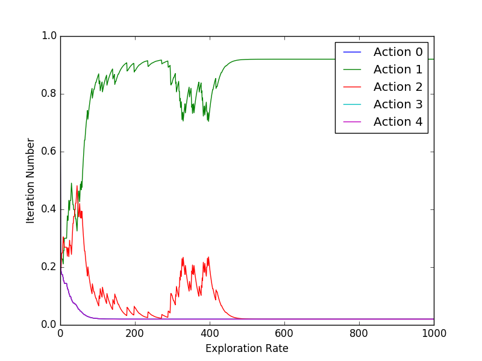

# RedCoast
> RedCoast is a research project that focuses on implementing and testing (social) robot learning algorithms. At current stage it is a personal repo.

[![NPM Version][npm-image]][npm-url]
[![Build Status][travis-image]][travis-url]

One to two paragraph statement about your product and what it does.



## Installation

Linux 14.04:

## Usage example

A few motivating and useful examples of how your product can be used. Spice this up with code blocks and potentially more screenshots.

## Development setup

Describe how to install all development dependencies and how to run an automated test-suite of some kind. Potentially do this for multiple platforms.

```sh
make install
npm test
```

## Release History

* 0.0.1
    * Work in progress

## Meta

Alex Yuan Gao – [@YourTwitter](https://twitter.com/dbader_org) – gaoyuankidult@gmail.com

Distributed under the XYZ license. See ``LICENSE`` for more information.

[https://github.com/yourname/github-link](https://github.com/dbader/)

[npm-image]: https://img.shields.io/npm/v/datadog-metrics.svg?style=flat-square
[npm-url]: https://npmjs.org/package/datadog-metrics
[npm-downloads]: https://img.shields.io/npm/dm/datadog-metrics.svg?style=flat-square
[travis-image]: https://img.shields.io/travis/dbader/node-datadog-metrics/master.svg?style=flat-square
[travis-url]: https://travis-ci.org/dbader/node-datadog-metrics
